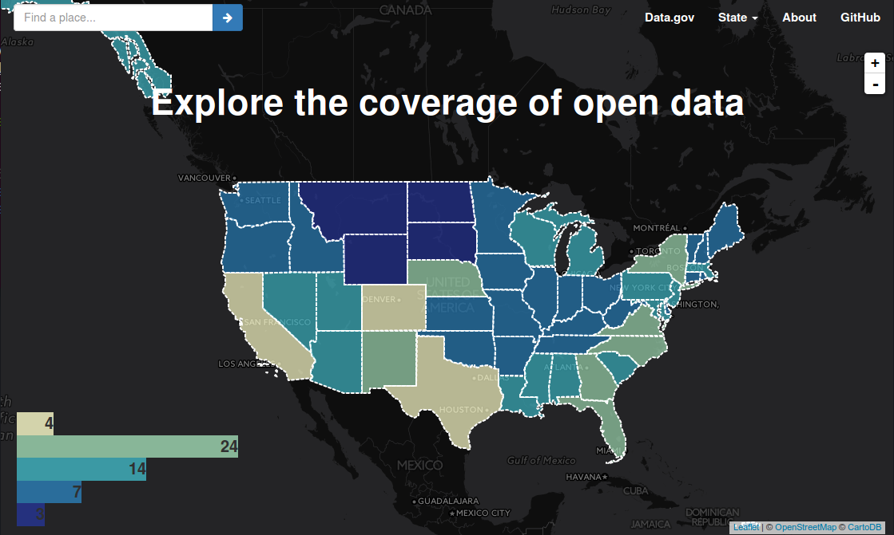

Open Data Discovery
===================

> We know everybody is on his way to publish data, but WHERE are those data?

**[Open Data Discovery](http://opendatadiscovery.github.io/)** is such a project to explore and visualize the geography of open data in [CKAN-based data portals](http://ckan.org/instances/#). We believe understanding the existing open data is as important as opening new data.

How does it work?
-----------------

[CKAN](http://ckan.org/), one of the most widely used open source data portal platform, provides several [APIs](http://docs.ckan.org/en/latest/api/index.html) that allows users to search data with the given geographical bounds.

If we would like to know the number of open data in [New York State](http://catalog.data.gov/dataset?q=&sort=score+desc%2C+name+asc&ext_location=New+York&ext_bbox=-79.7632%2C40.506%2C-71.87%2C45.0061&ext_prev_extent=), we could search with the state name and the state's latitude/longitude boundary box. It returns the summary of data opening (total number, tags, publishers, etc.)

With this functionality, we are able to get the open data summary for every administrative district and provide an overall map about the data opening for the entire study area.

This project was originally designed to visualize [Data.gov](http://www.data.gov/) and it is being extended to visualize any CKAN-based platform. The server of this project is hosted at an AWS EC2 instance and the server crawls all monitored data portals every week.

What does it map?
-----------------

| Portal   | Website                                      | Description                 |
|----------|----------------------------------------------|-----------------------------|
| Data.gov | [http://www.data.gov/](http://www.data.gov/) | U.S. Government’s open data |

How can I contribute?
---------------------

We welcome all kinds of suggestions and advices! Please feel free to contact Haoliang Yu at **haoliang.yu AT outlook.com**.

We are particularly seeking to know the official source of geographical boundaries for region with openn data portal. If you happen to know, please tell me.

Thanks to these awesome people!
-------------------------------

-	[Lizzi Slivinski](https://github.com/eSlivinski), for many advices on D3.js visualization
